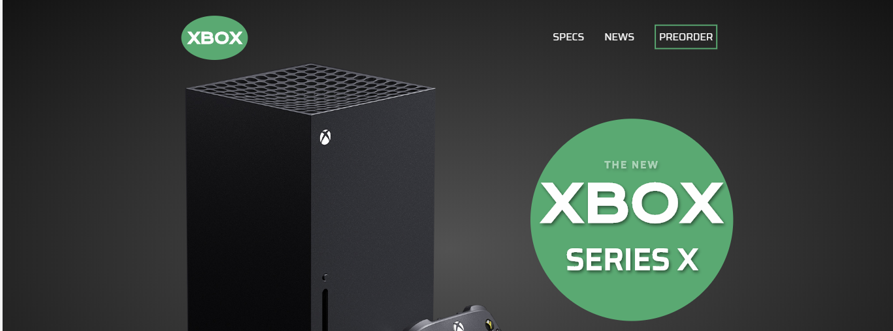

# One Color UI Challenge

<h2 align="center"></h2>

Designing and developing a basic one color primary website.
- Challenge color of #52A96F(Green)

Simple yet elegant one page site designed around the new XBOX Series X. Design and development done in a few hours. ONLY for desktop, none responsive.

- HTML5
    - Fully custom HTML including contact form for the xbox 'preorders'.
- CSS3
    - Fully custom CSS using grid to layout the different sections.

- Figma
    - Figma was used to create the wireframe for the site. This can be found in the 'readme-assets' folder.
- Photoshop
    - Photoshop was used to cut images from their backgrounds and fit in better.
- Google Fonts
    - Krona One
    - Saira
        - All with sans-serif as a fall back.
- Colors
    - Challenge color Green - #52A96F
    - Radial gradient background - #525252 - #131313
    - Text color - #f3f3f3

